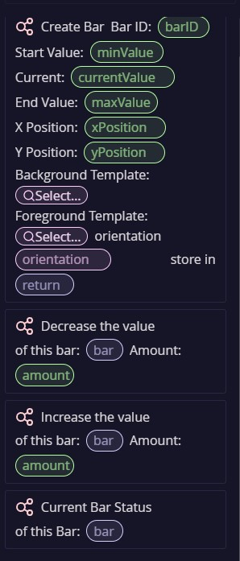
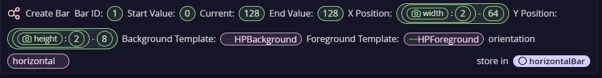
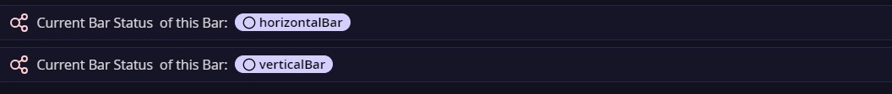

# General use of `helper.bars`
## HelperBars Documentation
`HelperBars` is a CTJS script catMod that provides functionalities for creating and manipulating various types of bars for your game. This documentation describes the features, usage, and API details of the module.

1. Features:

Create health bars, mana bars, or any kind of progress bar with customizable backgrounds and foregrounds.
Update the visual representation of the bar based on its current value.
Supports both horizontal and vertical orientations.
2. Installation:

(Assuming you have CTJS set up)

Download the HelperBars folder containing the blocks.js, types.d.ts, and index.js files.
Place the HelperBars folder inside your CTJS project's scripts directory.

3. Usage:

3.1 Creating a Bar:
```
const healthBar = createBar(
  'hpBar', // Unique ID
  0, // Minimum health
  100, // Starting health
  300, // Maximum health
  100, // X position
  50, // Y position
  // Background and foreground template references (from your templates library)
  backgroundTemplate,
  foregroundTemplate,
  'horizontal' // Optional: Orientation (horizontal or vertical)
);

```

3.2 Updating the Bar:

Use `increase(bar, amount)` to increase the bar's value by a certain amount.
Use `decrease(bar, amount)` to decrease the bar's value by a certain amount.
Use `currentBarStatus(bar)` to update the bar's visual representation based on its current value.
This function must be used every frame so keep in mind taht and use it into `Frame Start` or `Frame End`.

4. API Reference:

4.1 Interfaces (types.d.ts):

Bar: Defines the structure of a bar object, including properties for its ID, minimum and maximum values, current value, positions, templates, and orientation.
4.2 Functions:

`createBar(barID, minValue, currentValue, maxValue, xPosition, yPosition, backgroundTemplate, foregroundTemplate, orientation): Bar`
Creates a new Bar object with the specified parameters.
`increase(bar: Bar, amount: number): void`
Increases the current value of the bar by the specified amount.
`decrease(bar: Bar, amount: number): void`
Decreases the current value of the bar by the specified amount.
`currentBarStatus(bar: Bar): void`
Updates the visual representation (width or height) of the foreground template based on the bar's current value and orientation.

5. Catnip:
5.1 Catnip sidebar:


5.2 Catnip create bar
Use in `Room Start` or when you want to create a `Bar` but run the code once.


Use in `Frame Start`or `Frame End` 


A mini tutorial is available here: https://www.youtube.com/watch?v=tbdCMv8_vpo  and thats it...

Enjoy making bars...

By Ulises Freitas.
